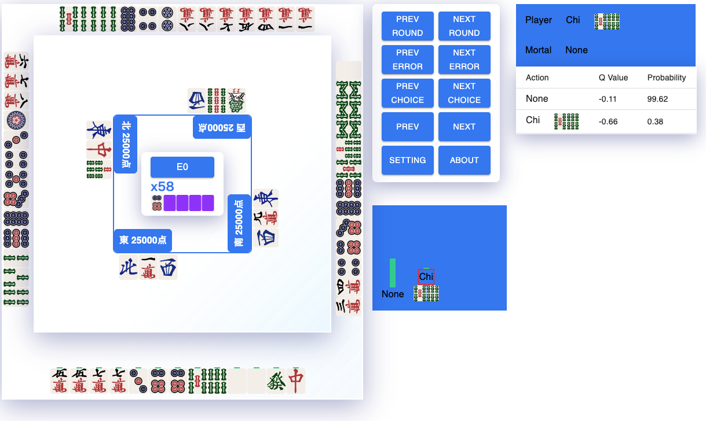
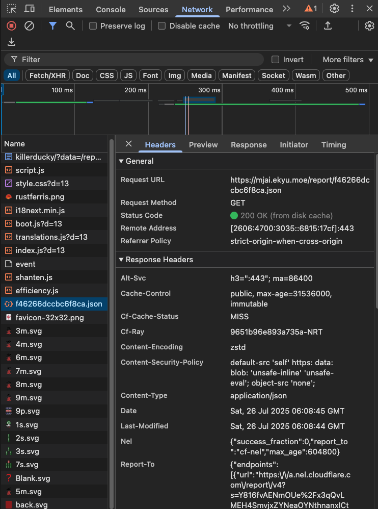

# Mortal Lens

Another alternative to review Mahjong Games.



## How to use
1. Review any game using Mortal AI
   https://mjai.ekyu.moe
2. Open JSON from the review page from the Network tab in developer tool
   Download it by copying the file to your local PC
   
3. Upload the JSON from the web app
    

## How to build and run the web app
You need to manually run this web app on your local PC to use this web app.
To build the application pnpm is required. Read the installation [here](https://pnpm.io/ja/installation) is you haven't installed it.

This application also has external dependency that is not published to npm. You need to prepare these packages locally.
Clone the below 2 repos.
```git
git clone https://github.com/SakaiTaka23/mjai-ts.git
git clone https://github.com/SakaiTaka23/riichi-mahjong-tiles.git
```
These repo should be at the same folder as this repo.

```
.
├── mjai-ts
├── mortal-lens
├── riichi-mahjong-tiles
```
Also build those repo as well.
```shell
cd mjai-ts
pnpm build
cd ../
cd riichi-mahjong-tiles
pnpm build
```
Build all packages in this repo. Execute the below command at the top level of this repo.
```shell
pnpm build
```
Run the app.
```shell
pnpm preview
```
Access the app http://localhost:4173
